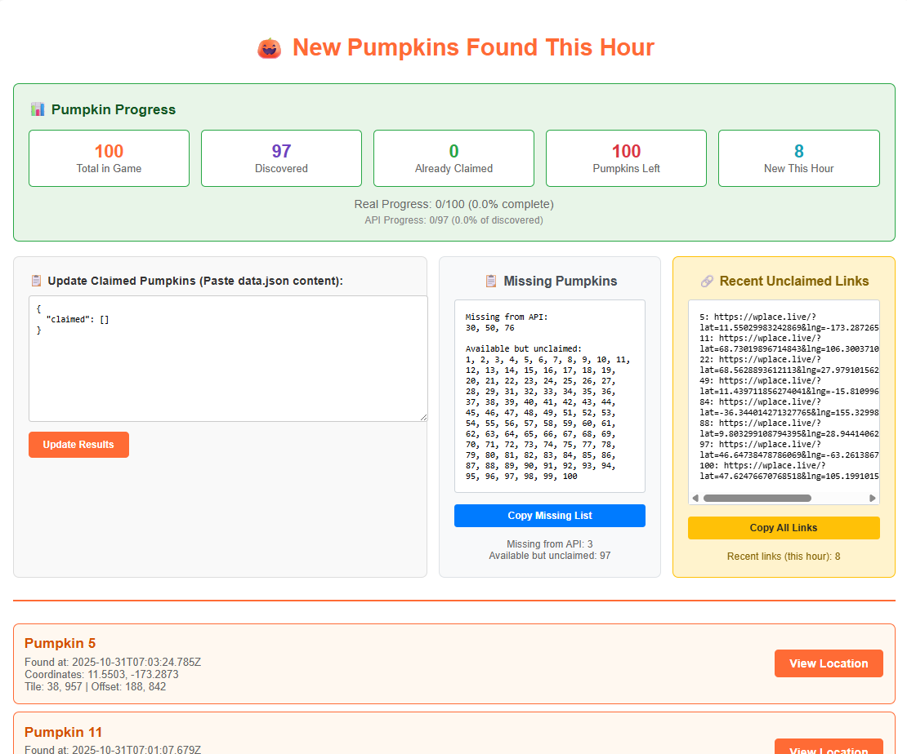

# 🎃 PumpkinSnatcher

A tool to track and find new pumpkins from the wplace pumpkin event, showing real-time progress and filtering for recently discovered pumpkins.

## Features

- **Real-time Progress Tracking**: See your completion status against both discovered pumpkins and the total 100 pumpkins
- **Recent Pumpkin Detection**: Automatically filters to show only pumpkins found within the current hour
- **Interactive Web Interface**: Easy-to-use web dashboard with live updates
- **Comprehensive Statistics**: Track total, discovered, claimed, and remaining pumpkins
- **Direct Location Links**: Click to view pumpkin locations on wplace.live

## Usage Screenshot



*The web interface showing progress tracking with 90/100 pumpkins claimed and real-time updates*

## How to Use

1. **Run the Application**
   ```bash
   python fetch_pumpkin_data.py
   ```

2. **Wait for Server to Start**
   - The script will automatically open your browser to `http://127.0.0.1:5000`
   - You'll see the pumpkin progress dashboard

3. **Update Your Progress**
   - Go to https://backend.wplace.live/event/hallowen/pumpkins/claimed
   - Copy all the JSON text from that page
   - Paste it in the "Update Claimed Pumpkins" box on the dashboard
   - Click "Update Results"

4. **View New Pumpkins**
   - All pumpkins found within the current hour that you haven't claimed will be displayed
   - Click "View Location" to open the pumpkin location on wplace.live
   - The progress statistics update automatically to show your current completion status

## Progress Display

The dashboard shows:
- **Total in Game**: 100 (actual total pumpkins)
- **Discovered**: Number currently available in the API
- **Already Claimed**: Pumpkins you've collected
- **Pumpkins Left**: How many more you need to find
- **Real Progress**: Your progress against all 100 pumpkins
- **API Progress**: Your progress against discovered pumpkins only